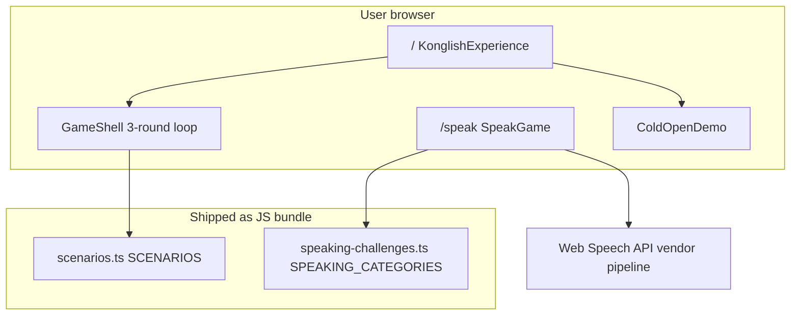
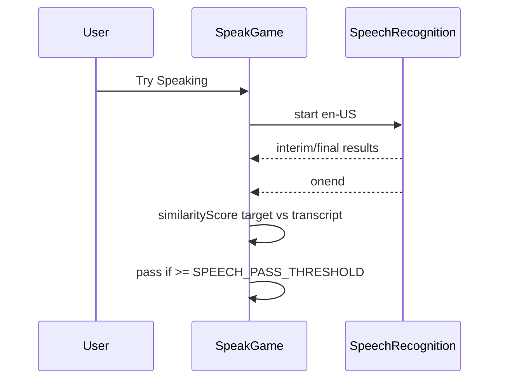

# Architecture

This document describes **what exists in the repository today**. It is not a roadmap dressed as reality.

## System context

There is **no** application server component authored in this repo for game logic. `next start` serves the built React app and static assets.

## App Router

| Route | File | Renders |
|-------|------|---------|
| `/` | `src/app/page.tsx` | `KonglishExperience` |
| `/speak` | `src/app/speak/page.tsx` | `SpeakGame` (+ route `metadata`) |

`src/app/layout.tsx` wraps all pages: loads `globals.css`, wires **Geist** + **Noto Sans KR**, sets `<html lang="ko">`, pulls `metadata` from `src/lib/game-meta.ts`.

## Scenario game (choice-based)

**State owner:** `KonglishExperience` uses `screen: "home" | "game" | "result"` plus `activeScenario: Scenario | null`.

- **Home:** `ColdOpenDemo`, `ScenarioPreview`, `WhyDifferent`, footer CTA. `ColdOpenDemo` embeds a **fixed** mini-flow (`immigration` subset) via `getScenarioById`-style lookup in code.  
- **Game:** `GameShell` receives the full `Scenario`.  
- **Result:** `ResultCard` receives `TurnRecord[]` and totals-derived rank.

**Round engine (`GameShell`):**

- Exactly **3** rounds (`roundIndex` 0..2).  
- Per round: `step` alternates `"answer"` → `"review"` → next round.  
- `handlePick` appends chat lines (`ChatBubble` stream), merges `ChoiceScores` into `RunningTotals` via `applyScores` from `src/lib/scoring.ts`, records `TurnRecord`.  
- **Manual path:** user can open manual entry; `manualChoiceFromText` in `src/lib/manual-fallback.ts` synthesizes a `Choice` with neutral-ish scores so free typing never hard-crashes the loop.

**Scoring model:** scores are **authored constants** on each `Choice`, not computed from NLP. `compositeScore` and `pickRankTitle` interpret totals against `scenario.rankLadder`.

## Speak mode (microphone + fuzzy match)

**State owner:** `SpeakGame` (single client component file) composes:

- `CategoryRail`, `SentenceCard`, `MicButton`, `SpeakRules`, `SpeechResult`, `PanicMeter`  
- Data: `SPEAKING_CATEGORIES`  
- SR constructor detection: `getWebSpeechRecognitionCtor()` + `useSyncExternalStore` so support is evaluated client-side without an eslint “setState in effect” footgun.

**Recognition flow (simplified):**

**Demo / practice:** separate buttons call the same judgment helper with `mode: "demo"` (simulated transcript) or `mode: "self"` (always pass with explicit banner copy).

## Data architecture

| File | Export | Role |
|------|--------|------|
| `src/data/scenarios.ts` | `SCENARIOS` | All choice-based scenarios |
| `src/data/speaking-challenges.ts` | `SPEAKING_CATEGORIES`, `getCategoryById` | Speak categories + sentences |
| `src/lib/types.ts` | `Scenario`, `Round`, `Choice`, … | Shared typings |
| `src/lib/game-meta.ts` | `GAME_DISPLAY_NAME`, taglines | Branding + SEO strings |

No runtime JSON fetch for game content — **tree-shaken imports** keep deploy simple.

## Styling architecture

- Tailwind v4 via PostCSS (`postcss.config.mjs`).  
- Shared visual language in `src/app/globals.css`: `.glass-panel`, `.btn-neon-primary`, `.konglish-aurora`, keyframes (`float-drift`, `reveal-pop`, …).  
- Components favor utility classes + a few shared class names above.

## Why frontend-only

- **Hackathon velocity:** one deploy target, no session store to operate during a booth.  
- **Honest gameplay:** reactions are curated; no LLM latency or key management in MVP.  
- **Demo reliability:** offline-ish behavior after load; predictable except for browser SR variance.

## Build / runtime

- `next.config.ts` enables React Compiler.  
- `pnpm build` runs `next build` (typecheck + optimize).  
- No `DATABASE_URL`, no `NEXT_PUBLIC_*` API base URLs in source today.

## Extension points (code reality)

| Want to… | Touch… |
|----------|----------|
| New scenario | `scenarios.ts` + ensure ID appears in UI selection |
| New speak lines | `speaking-challenges.ts` |
| Tune speech leniency | `speech-scoring.ts` |
| New homepage section | `KonglishExperience.tsx` and/or sibling components |
