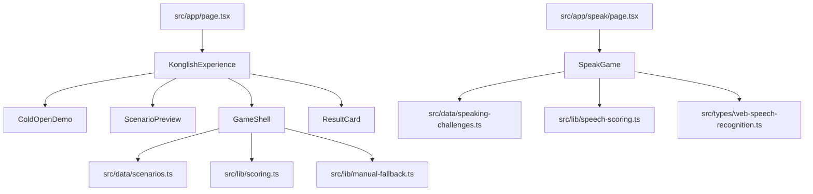

# Documentation index

Central map for **how this repository works internally**. Public onboarding stays in [README.md](README.md); architecture diagrams and boundaries live in [ARCHITECTURE.md](ARCHITECTURE.md).

---

## Table of contents

1. [Purpose and scope](#1-purpose-and-scope)  
2. [Documentation map](#2-documentation-map)  
3. [Runtime dependency graph](#3-runtime-dependency-graph)  
4. [User flows](#4-user-flows)  
5. [Algorithms and scoring](#5-algorithms-and-scoring)  
6. [HTTP API reference](#6-http-api-reference)  
7. [Configuration and environment](#7-configuration-and-environment)  
8. [Database schema](#8-database-schema)  
9. [Deployment and CI/CD](#9-deployment-and-cicd)  
10. [Troubleshooting](#10-troubleshooting)  
11. [Code style and lint](#11-code-style-and-lint)  

---

## 1. Purpose and scope

**mvp-incathon** ships a static Next.js bundle that implements:

1. **Foreign NPC** — scripted Konglish-vs-natural English **choice game** (5 scenarios × 3 rounds × 3 choices).  
2. **말하면 산다** — `/speak` **speech challenge** using browser SR + local fuzzy string scoring.

Out of scope **today**: user accounts, REST/GraphQL APIs authored in this repo, server-side persistence, LLM integration.

---

## 2. Documentation map

| Doc | Contents |
|-----|----------|
| [README.md](README.md) | Install, routes, features, philosophy |
| [ARCHITECTURE.md](ARCHITECTURE.md) | Router, components, data, diagrams |
| [CONTRIBUTING.md](CONTRIBUTING.md) | How to change scenarios / speak data |
| [SECURITY.md](SECURITY.md) | Permissions, reporting |
| [docs/gameplay.md](gameplay.md) | Loops, UX intent |
| [docs/speech-recognition.md](speech-recognition.md) | SR + fuzzy match detail |
| [docs/design-system.md](design-system.md) | Visual tokens and patterns |
| [docs/roadmap.md](roadmap.md) | Non-binding ideas |

---

## 3. Runtime dependency graph

`AnimatedBackdrop` and other presentational wrappers are omitted for clarity.

---

## 4. User flows

### 4.1 Scenario selection → game → result

1. User on `/` scrolls or uses embedded demo.  
2. `ScenarioPreview` calls `onPick(id)` → `KonglishExperience` resolves `SCENARIOS.find`.  
3. `GameShell` runs three rounds; each answer updates `RunningTotals`.  
4. `onFinish(turns)` switches to `ResultCard` with `pickRankTitle(scenario, totals)`.

### 4.2 Speak mode

1. User opens `/speak`.  
2. Picks category (`CategoryRail` → `categoryId`).  
3. `SentenceCard` shows `sentenceIndex` modulo category length.  
4. **Try Speaking** starts `SpeechRecognition`; on end, transcript compared via `similarityScore`.  
5. **SpeechResult** shows pass/fail, bands from `scoreLabelFromPercent`, streak, rank string from `computeRankTitle`.

---

## 5. Algorithms and scoring

### 5.1 Choice game (`src/lib/scoring.ts`)

- `emptyTotals()` — zeros.  
- `applyScores` — component-wise sum of `ChoiceScores`.  
- `compositeScore(totals, 3)` — weighted blend of averages ± cringe penalty + understood bonus.  
- `pickRankTitle` — maps composite score to index in `scenario.rankLadder`.  
- `survivalSnapshotPercent` — used by `SurvivalReveal` / demo surfaces for quick single-choice %.

### 5.2 Speak mode (`src/lib/speech-scoring.ts`)

1. `normalizeSpeechText` — lowercase, strip non `[a-z0-9\s]`, collapse whitespace.  
2. `similarityScore(expected, spoken)` — combines **character similarity** from normalized Levenshtein distance (weight 0.45) with **token Jaccard** overlap (weight 0.55).  
3. `passesSpeechThreshold` — `score >= SPEECH_PASS_THRESHOLD` where threshold is **`0.76`** as shipped.  
4. `scoreLabelFromPercent` — maps integer percent to bands (`Native Energy`, `Survived`, …).

### 5.3 Manual free-text fallback (`src/lib/manual-fallback.ts`)

Returns a synthetic `Choice` with fixed middling scores and explanatory copy — prevents dead-end UX when user insists on typing.

---

## 6. HTTP API reference

**None.** This application does not define Next.js Route Handlers or legacy API routes for gameplay. “API” in the sense of **browser APIs** used:

- **Web Speech API** — `SpeechRecognition` / `webkitSpeechRecognition` (speak mode only).

---

## 7. Configuration and environment

| Input | Location | Notes |
|-------|----------|-------|
| Next.js | `next.config.ts` | `reactCompiler: true` |
| TypeScript | `tsconfig.json` | strict, `@/*` → `./src/*` |
| ESLint | `eslint.config.mjs` | `eslint-config-next` |
| Tailwind | `src/app/globals.css` | `@import "tailwindcss"` + `@theme inline` |
| Env vars | none required | `.env*` gitignored; add only when a feature truly needs secrets |

---

## 8. Database schema

**None.** No Prisma, Drizzle, SQL, or embedded DB. All structured content is TypeScript modules under `src/data/` and `src/lib/types.ts`.

---

## 9. Deployment and CI/CD

**Not configured in-repo** (no `.github/workflows/*.yml` today). Typical deploy: Vercel, Netlify, or any Node host running `pnpm build && pnpm start` behind HTTPS.

CI is recommended as a follow-up: at minimum `pnpm lint && pnpm build` on PR.

---

## 10. Troubleshooting

| Symptom | Likely cause | What to check |
|---------|--------------|---------------|
| `/speak` mic never starts | Unsupported browser / HTTPS | Chrome desktop; secure context |
| Empty transcript, instant fail | Permission denied or no speech | UI labels + demo buttons |
| `pnpm build` type error | Strict TS regression | `next build` log, file path |
| Scenario not in grid | ID not in `SCENARIOS` or preview filter | `scenarios.ts` + `ScenarioPreview` |

---

## 11. Code style and lint

- **Formatter:** not enforced by a repo-wide Prettier config in tree — match existing file style.  
- **Lint:** `pnpm lint` → ESLint 9 + `eslint-config-next` (core-web-vitals + typescript).  
- **Imports:** `@/…` alias from `tsconfig.json`.  
- **Client boundaries:** add `"use client"` only when using hooks or browser APIs in that module.

---

## Remaining documentation gaps

- No checked-in **screenshots** (`docs/assets/` referenced from README).  
- No **automated CI** documented beyond suggestion.  
- **No ADR folder** for historical decisions — add if the team grows.
